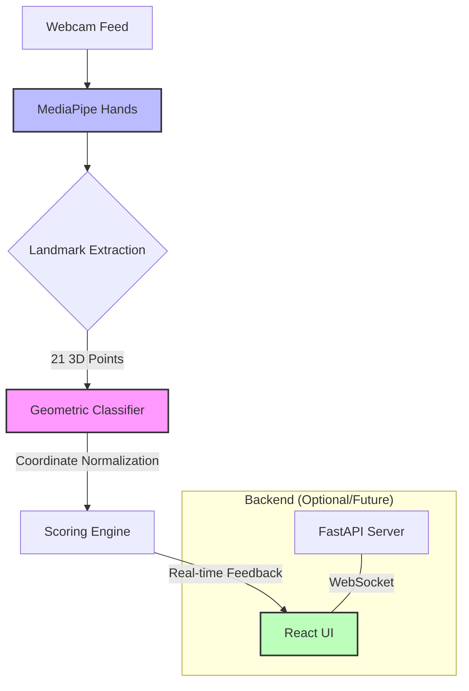

# 🤟 Signly — AI-Powered ASL Learning Platform

Signly is a modern, interactive web application designed to make learning American Sign Language (ASL) intuitive and engaging. By combining **real-time computer vision** with a comprehensive curriculum, Signly provides instant feedback on your hand signs, helping you master the ASL alphabet with confidence.

---

## 🏗️ System Architecture

Signly uses a multi-layered approach to process video frames and provide real-time classification.



---

## ✨ Key Features

- **📖 Interactive Dictionary** — Explore all 26 ASL alphabet letters with reference GIFs, hand shape guides, and professional tips.
- **🎮 Visual Quiz** — Test your recognition skills by identifying signs from images in a fast-paced, timed environment.
- **📷 Camera Quiz** — Step up to the challenge! Sign the correct letter into your webcam and get instant AI validation.
- **🖐️ Real-time Tracking** — Visualize how the AI "sees" your hand with a live skeleton overlay (21 landmark points).
- **⚡ Fingerspelling Practice** — Practice spelling full words letter-by-letter with a continuous detection loop.

---

## 🛠️ Technology Stack

| Layer | Technology |
| :--- | :--- |
| **Frontend** | React 18, Vite, TailwindCSS |
| **State Management** | Zustand |
| **Computer Vision** | MediaPipe Hands (TFLite) |
| **Animations** | Framer Motion |
| **Backend** | FastAPI (Python), WebSockets |
| **Icons** | Lucide-React |

---

## 🚀 Getting Started

### Prerequisites
- **Node.js** (v18 or higher)
- **Python** (v3.9 or higher)
- A working **Webcam**

### 1. Frontend Setup
```bash
# Install dependencies
npm install

# Run the development server
npm run dev
```
Navigate to `http://localhost:5173` to view the app.

### 2. Backend Setup (Optional)
The backend provides a WebSocket endpoint for advanced sign prediction.
```bash
# Install Python dependencies
pip install fastapi uvicorn

# Start the server
uvicorn main:app --reload
```
The backend runs on `http://localhost:8000`.

---

## 📖 How to Use

1. **Browse:** Start in the **Dictionary** to familiarize yourself with the hand shapes for each letter (A-Z).
2. **Train:** Go to **Practice** and enable your camera. Watch the skeleton overlay to see how your hand position is being tracked.
3. **Test:** Choose **Visual Quiz** for recognition practice or **Sign It** to test your muscle memory against the AI.
4. **Master:** Aim for high scores by maintaining clear lighting and keeping your hand centered in the frame.

---

## 🧠 How it Works: The Scoring Engine

Signly doesn't just "guess" the letter; it performs a geometric analysis of your hand's topology:

1. **Normalization:** The system calculates the distance between your wrist and middle finger MCP to normalize all coordinates. This makes the detection independent of how far your hand is from the camera.
2. **Feature Extraction:** It checks for specific states like:
   - `isExtended`: Is the fingertip higher than the knuckle?
   - `isCurled`: Is the fingertip tucked into the palm?
   - `isNear`: Is the thumb tip touching the index finger?
3. **Scoring:** Each letter has a unique scoring function (e.g., `scoreA`, `scoreL`) that returns a confidence value between 0 and 1 based on these geometric rules.

---

## 📂 Project Structure

```text
signly/
├── src/
│   ├── components/       # Reusable UI (Navbar, SignCard, Webcam)
│   ├── hooks/            # Logic for MediaPipe & WebSockets
│   ├── pages/            # Route-level views (Home, Quiz, Dictionary)
│   ├── store/            # Zustand global state (Quiz, Settings)
│   ├── utils/            # Geometric landmark classifier logic
│   └── data/             # A-Z sign data and word lists
├── public/
│   ├── assets/signs/     # Reference GIFs for every letter
│   └── models/           # MediaPipe TFLite task files
├── main.py               # FastAPI WebSocket server
└── tailwind.config.js    # Design system configuration
```

---

## 🗺️ Roadmap

- [ ] **Dynamic Gestures** — Support for signs involving motion (e.g., J and Z).
- [ ] **Mobile Optimization** — Improved UI/UX for hand-held learning.
- [ ] **Multi-hand Support** — Advanced signs requiring both hands.
- [ ] **Dark Mode** — Toggle for late-night practice sessions.
- [ ] **Cloud Sync** — Save your quiz progress and daily streaks.

---

## ⚠️ Camera Tips

- **Lighting:** Detection works best in well-lit environments.
- **Background:** High-contrast backgrounds (your hand vs. the wall) improve accuracy.
- **Orientation:** Currently optimized for **Left-Hand** users (mirrored in code), but works for both with standard frontal view.
